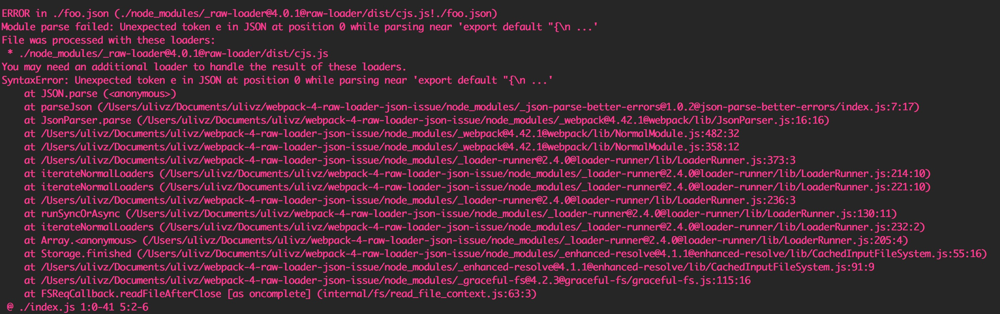

# raw-loader-load-json-repro 

## Step to reproduce

1. `git clone https://github.com/ulivz/raw-loader-load-json-repro`
2. `yarn`
3. `npx webpack`
4. You'll got following error:



4. Modify entry `index.js`，comment `json` import and uncomment `js` import:

```diff
- import foo from 'raw-loader!./foo.json' // don't work
+ // import foo from 'raw-loader!./foo.json' // don't work
- // import foo from 'raw-loader!./foo.js' // work
+ import foo from 'raw-loader!./foo.js'

export default {
  foo,
}
```

Ru-run `npx webpack`，the build will be success.

## Expected Behavior

`*.json` should be loaded successfully with raw-loader like the `*.js`;

## Actual Behavior

`*.json` cannot be loaded successfully.


